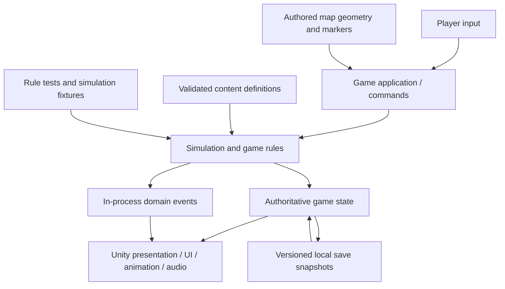

# 03 · Architecture

## Shape: a modular single-player application

Build one game with a few explicit modules. Use AI during production; the initial shipped game should need neither an AI API nor an application server. This is a proposed product boundary, not an assumption that the user requested live AI gameplay.



The arrows describe responsibility, not a requirement for a message broker, event-sourced storage, or multiple processes.

## Boundaries

| Module | Owns | Must not own |
|---|---|---|
| **Core** | Calendar, crops, inventory, recipes, economy, requests, schedule decisions, validation | Unity types, texture loading, sound playback, direct filesystem calls |
| **Application** | Session lifecycle, command dispatch, action coordination, map transitions, save orchestration | Drawing, vendor API calls, duplicate copies of core rules |
| **Presentation** | Sprites, animation selection, camera, UI, audio feedback, scene objects | Awarding money/items, changing crop maturity, deciding quest completion |
| **Content** | Read-only definitions and stable content IDs | Mutable player progress |
| **Persistence** | Serialization, atomic replacement strategy, backups, schema migrations | Unity object references or undocumented save assumptions |
| **Editor tools** | Content validation, imports, reference checks, fixture setup, inspection utilities | Required runtime services or production secrets |

The core need not be a separate published package. Begin with an assembly definition and a small set of ordinary C# classes. Add interfaces only where there is an actual boundary to test or substitute.

## State ownership

Keep one authoritative `GameState` for the session. A convenient proposed breakdown is `PlayerState`, `CalendarState`, `FarmState`, `InventoryState`, `WorldObjectState`, `NpcState`, and `ProgressState`.

The renderer can cache sprite references and derived display data. It cannot become a second authoritative inventory or crop database. Scene reloads reconstruct views from state rather than creating new progress.

Definitions and instances are different. A `CropDefinition` describes a crop type; a `CropInstance` describes the specific plant at a map coordinate. An item's display name is not its identity. Use stable IDs such as `crop.cucumber`, `item.cucumber`, and `recipe.pickles`.

## Typical tool action

```text
Input intent
  → resolve intended target
  → validate player, tool, target, reach, and current action state
  → start a timed action with an action ID
  → at the gameplay contact time, validate relevant conditions again
  → apply all changes once
  → publish feedback events
  → animate / sound / update UI
```

A miss or invalid action changes no inventory, stamina, or world state unless a documented rule specifically says otherwise. Repeated button events must not apply the same action twice.

**Animation is not the authority.** A missing clip, changed playback rate, or interrupted view cannot duplicate a harvest or prevent the calendar from progressing. Use gameplay-owned action timing and let the animation track it. Animation events may trigger cosmetic effects, not irreversible rewards.

## Time and movement

Separate three concepts: real elapsed time; logical game time; and presentation animation time. The rule module handles integer game minutes/days and scheduled transitions. Movement can use a fixed update cadence, with visuals interpolated or pixel-snapped separately.

Do not promise deterministic cross-platform Unity physics. Deterministic tests here concern the pure game-rule simulation under a fixed input sequence, ordered updates, and controlled random state. Test actual movement and collision in engine-level tests.

Unloaded maps retain durable state. They do not need running Unity objects for every crop or machine. Advance logical timers when game time changes or when the map is loaded, using the same rules as an active map.

## Spatial model

Use named maps connected by explicit exits, not an initial seamless world. Each map has a tile coordinate system, static walkability, interaction markers, spawn points, and a set of placed objects.

Visual height is distinct from collision footprint. A tall tree can occupy one or several ground cells while its canopy draws in front of a character. Sort character/object visuals by a ground-contact anchor with a stable tie-breaker. Avoid using the top of the sprite or transparent canvas bounds as the sort origin.

Keep mutable farming layers distinct from decorative terrain. The appearance of soil is a projection of farm state; the presence of a brown sprite is not the rule that permits planting.

## Data-first authoring

Start with JSON definitions validated against an explicit schema. Import them into a read-only catalog. A generated ScriptableObject registry is acceptable as an engine convenience, but it must be generated from the canonical content—not hand-maintained in parallel.

Content validators should detect missing IDs, invalid cross-references, duplicate recipes, unsupported animation names, impossible stage values, and map markers with no destination. Add custom inspectors only when editing JSON has become a demonstrated bottleneck.

## Proposed repository layout

```text
/
  README.md
  AGENTS.md                       # approved instructions, adapted from template
  docs/
    decisions/
    features/
    playtests/
  game/                           # one Unity project
    Assets/Game/
      Core/
      Application/
      Presentation/
      Persistence/
      Content/Definitions/        # canonical JSON game content
      Content/Generated/          # reproducible engine-facing catalog
      Art/Approved/               # approved .aseprite and/or static PNG sources
      Audio/Approved/
      Maps/
      Editor/
      Tests/EditMode/
      Tests/PlayMode/
    Packages/
    ProjectSettings/
  production/
    art-candidates/               # not imported into the shipping build
    asset-records/
    style-guide/
    source-provenance/
  tools/                          # deterministic validators and review utilities
  evidence/                       # small reports; large captures outside normal Git
```

This is a proposed layout, not directories already created for a game. Keep Unity metadata with its assets. Exclude generated caches, local saves, API credentials, and build output from ordinary version control. Choose an appropriate large-file policy for binary art/audio; test clean checkout, not just local cache reuse.

## Build versus buy versus defer

Use engine facilities for rendering, input, ordinary collision, audio mixing, and UI. Own the specific farming/economy/progression rules and a narrow import/validation layer. Evaluate a dialogue package only after requirements are known. Defer a generic event-sourcing platform, ECS conversion, custom dependency injection, networking abstractions, universal editors, and procedural town generation.

The test of an abstraction is whether it makes the **next two concrete features** simpler. Hypothetical future games are not a sufficient reason to build it now.


## Alternative implementation shapes

### Browser-first: Phaser and TypeScript

Keep the same ownership boundaries, but implement the domain in TypeScript rather than C#. Use Phaser for the game view/input/audio, and choose one map-authoring path such as Tiled JSON. A browser save adapter must be tested for storage persistence, quota/failure behavior, and export/import recovery. A desktop wrapper, storefront integration, and controller support are separate acceptance tasks—not automatic consequences of a browser build. [S18–S20]

This is a sensible choice when fast browser playtests and your existing TypeScript familiarity are the strongest priorities. Start with ordinary local game data; a farming game does not inherently require React, Next.js, an API server, or a hosted database. Introduce web application frameworks only for a separate site or demonstrated UI requirement.

### Lightweight engine: Defold and Lua

Use ordinary Lua modules for rules, engine scripts/components for presentation and interactions, and explicit data contracts between them. Defold's text-oriented resources and cross-platform editor make this worth a real trial when Unity's editor overhead is unattractive. Its engine facilities do not remove the need to design saves, content validation, and readable NPC behavior. [S21]

### Native code-first: MonoGame and C#

Keep a plain C# domain and use MonoGame as the rendering/input/audio foundation. Add only the map, UI, and asset-import tools the slice needs. This offers direct code ownership but makes those integrations part of your workload; it is not the low-effort route by default. [S22]

These are alternative products, not three frontends to implement now. The conceptual architecture can transfer; a TypeScript domain is not a drop-in replacement for C# or Lua source. Choose one path after the trial and stop investing in the others.
