# 05 · Art and Animation Pipeline

## The goal is repeatable acceptance, not one impressive image

Use PixelLab to generate candidates, Aseprite to inspect and organize approved art, and Unity to display and animate it. PixelLab documents editor integration and cloud-based generation; the workflow does not require running an image model on the development GPU. [S10, S14]

Not being able to draw does not prevent choosing a silhouette, rejecting a bad loop, shifting a frame, correcting a stray pixel, or using a licensed base pack. Plan for those editing tasks. Budget optional specialist help for a small set of master assets when repeated AI correction is more expensive than focused human work.

## Provisional art contract

Validate these values in a composite scene before producing a cast. They are design proposals, not PixelLab endpoint defaults.

| Attribute | Starting proposal | Must be decided before bulk generation |
|---|---|---|
| View | Orthogonal map with a consistent low top-down character view | How much of roofs, faces, and object tops is visible |
| Ground grid | 16×16 pixel tiles | Whether a 32×32 grid is materially easier to produce consistently |
| Character scale | Approximately 16×32 visible silhouette | Actual supported generation canvas and cleanup/cropping method |
| Canvas | A consistent larger transparent action canvas with a fixed foot anchor | Maximum tool reach; no clipping in any action |
| Directions | Four displayed cardinal facings | How diagonal movement chooses facing |
| Palette | One small, approved palette with defined material ramps | Skin, foliage, soil, UI, shadow, and highlight conventions |
| Lighting | One consistent baked light direction; restrained engine lighting | Prevent double lighting and contradictory shadows |
| World viewport | Trial 480×270 logical pixels | Integer scaling/letterboxing and camera readability at target displays |
| UI | Independently readable, scalable text and layout | Avoid making text tiny merely to match world pixels |

A 16×32 silhouette does **not** mean every generator accepts a 16×32 request or produces that exact occupied area. Check the selected model's canvas constraints and measure its output. Crop or pad losslessly; do not blindly downsample a large illustration and call it game-ready.

## Asset flow

```mermaid
flowchart LR
    Brief[Asset brief and approved references] --> Candidate[PixelLab candidate batch]
    Candidate --> Inspect[Contact sheet and loop review]
    Inspect -->|reject or revise| Candidate
    Inspect --> Edit[Aseprite cleanup and tags]
    Edit --> Validate[Deterministic checks and manifest]
    Validate --> Import[Unity import and bindings]
    Import --> Scene[In-game acceptance scene]
    Scene --> Approved[Versioned approved asset]
```

Limit iteration with a cost cap. Never let an agent regenerate the whole batch to fix one rejected frame without reviewing the cheaper correction options.

## Interface-specific PixelLab checks

The MCP guide distinguishes character modes and animation modes. Standard character creation supports four/eight directions; pro/v3 force eight, with different ignored controls. Referenced character rotation is a v3 path. Animation frame control applies to v3, not universally; custom animations default to one direction unless directions are supplied. Inspect retained reference frames before assuming an export's length. These are documented interface behaviors, not measured output quality. [S11]

Use template motion for a baseline walk test. Use a custom-animation route for hoeing, watering, harvesting, or carrying only after verifying the actual supported mode, frame count, reference handling, and output. The REST catalog separately documents text-animation and skeleton-conditioned routes; do not copy MCP argument names into REST requests. [S12, S15]

Skeleton-conditioned generation produces image frames; do not assume the result is an editable runtime rig. Likewise, an outfit-transfer operation is not a guarantee of runtime-ready clothing layers. [S15, S16]

## First art feasibility batch

Produce one original player, one NPC, grass/soil/path transitions, one crop's growth stages, one tool, and one processing object. The player needs idle, walk, and the three relevant farming actions in the displayed directions. The NPC needs only idle/walk and an interaction pose if necessary.

Compare everything **together**, at intended display size. A sprite that looks attractive in isolation can be unusable because its scale, perspective, palette, or contact point differs from the rest.

Keep a “golden set”: the approved player, one terrain sample, one building/object, one crop, and one UI panel. Every subsequent batch is judged against this set. Do not rely on a prose prompt alone as the style specification.

## Character consistency checks

Inspect silhouette, head/body ratio, clothing details, handedness, visible tool shape, facial features, light direction, and apparent height across facings. Do not mirror asymmetric characters or tools unless the design explicitly permits the resulting changes.

Review animations as loops and as individual frames. Check planted feet, unintended body translation, changing limb lengths, disappearing accessories, unexpected extra frames, and first/last-frame discontinuities. Do not use smoothing or frame interpolation that destroys the approved pixel grid.

Four directions are a production choice: diagonal movement can still exist. Eight-direction artwork is not automatically required for eight-direction input.

## Gameplay animation contract

Each action has an action ID, displayed facing, startup duration, contact time, recovery duration, cancellation policy, target anchor, and animation key. Use one agreed convention for timing units and frame indexing.

Gameplay commits the tool result at the authoritative contact time. The sprite shows the corresponding contact frame. A watering can should reach the selected soil tile; its hand/tool relationship should remain coherent; the contact effect and sound should not appear before the tool arrives.

For the slice, baked full-character action frames may be simpler than separate body/tool layers. Layered equipment becomes attractive only after hand anchors, front/back draw order, and occlusion are stable. A flattened AI image does not automatically provide those layers.

Example production arithmetic: one character × four directions × five actions × six frames is **120 frame cells** before alternate outfits, damage variants, or emotional states. Frame cells are not the same as paid generations. Use this arithmetic to estimate review work, not API charges.

## Terrain and maps

Generate terrain transitions as a connected family. Define the tile connectivity convention and verify the returned layout before mapping it to engine autotiling. Do not assume a generated sheet matches a Unity RuleTile template by position alone.

Use a diagnostic map containing straight boundaries, inside/outside corners, tiny islands, thin paths, water edges, and repeated patches. Check visible seams, height cues, and wrong corner selection. Author walkability, exits, object footprints, and interaction points explicitly; image generation does not supply trustworthy game geometry.

## Import strategy

Proposed baseline: preserve approved `.aseprite` sources under Unity's art directory, with static PNGs where animation is unnecessary. Use the official Aseprite importer when its version passes the trial. The importer can create animation assets; its generated controller is read-only under the documented configuration, so keep custom gameplay state-machine logic in owned assets rather than editing generated output. [S06]

Aseprite's CLI supports repeatable exports and metadata, which is useful for inspection images and validation. A PNG+metadata export pipeline is the fallback when direct import proves unreliable; choose one authoritative import path per asset family. [S17]

Use common pixels-per-unit, point sampling, no unintended compression, and intentional pivots. Unity's Pixel Perfect guidance documents these preparations. Validate the chosen render-pipeline/package combination instead of assuming settings from an older tutorial are identical. [S07]

## Asset records and acceptance

Each asset record should contain its stable ID, brief revision, source/reference provenance, provider/interface/mode, submitted settings, returned job ID, actual dimensions, actual frame count, animation names, timing, pivots/anchors, output hash, costs, review result, and rights evidence.

An approved asset passes three gates: structural validation; visual approval; and in-game functional approval. Content-hash accepted outputs and retain their sources. A recorded seed is useful provenance but is not a promise that a changing hosted model will reproduce identical pixels.

Export approved assets promptly; do not treat provider job IDs or temporary download URLs as a backup system. Keep candidate media and secrets out of the shipping build.
