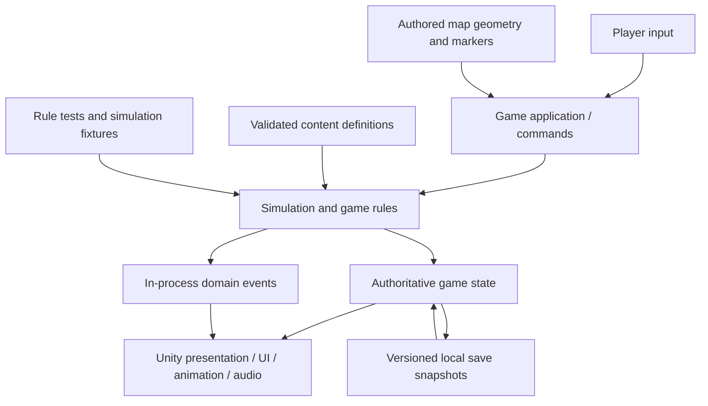

# Cozy Farming Game — Complete Preproduction Guide

Prepared for Brian · 17 September 2026 · Draft 0.1

This combines the planning documents and reusable templates. Each chapter is also supplied as a separate Markdown file in the accompanying ZIP. No game code has been implemented.


---

<a id="chapter-00"></a>

# Cozy Farming Game — Preproduction Pack

**Prepared for Brian · 17 September 2026 · Draft 0.1**

## Recommendation

Use **Unity 6.3 LTS, C#, PixelLab, and Aseprite** as the first stack to evaluate. Keep gameplay rules in a small, engine-independent C# module; let Unity supply rendering, input, audio, collision, UI, and authoring. Use a local coding agent with Unity's official MCP integration for editor work. Treat this as a recommendation to validate, not an engine commitment already made. [S01–S09]

**Phaser with TypeScript** is the strongest alternative when browser delivery and a web-style development loop matter more than a native game editor. **Defold** is worth considering when a lightweight, text-oriented engine and cross-platform editor are the priority. Do not build several prototypes in parallel unless the first candidate fails a specific requirement. [S19–S21]

PixelLab supplies production inputs, not finished game systems. A consistent sprite does not automatically have correct collision, tool contact, draw order, animation timing, or gameplay behavior. Those remain explicit contracts and review tasks in this plan.

## What this pack is—and is not

This is a starting architecture, production workflow, and decision framework for a new, original farming/life-simulation game. It is **not** a completed game design document, a promise of AI output quality, or an implemented project. No engine build, PixelLab generation, MCP connection, or paid integration has been tested for this project. Public documentation was checked; project-specific compatibility and quality still require the trials described here.

**Confirmed requirements:** Stardew Valley-like visual/gameplay direction; substantial AI assistance; no dependence on personal drawing ability; preference against Godot.

**Working assumptions:** solo-led development, single-player, offline play, Windows-first testing, four-direction pixel-art characters, and a small commercial-quality vertical slice before a larger game. These are proposals, not additional requirements attributed to Brian. Browser/mobile/console delivery, multiplayer, runtime generative AI, monetization, setting, and final content scale remain undecided.

## Read in this order

| Document | Purpose |
|---|---|
| [01 · Vision and scope](#chapter-01) | Player promise, assumptions, exclusions, scope control. |
| [02 · Engine decision](#chapter-02) | Five non-Godot choices, proposed stack, technical trial. |
| [03 · Architecture](#chapter-03) | Module boundaries, runtime flow, project layout, ownership. |
| [04 · Gameplay and persistence contracts](#chapter-04) | Time, farming, inventory, NPCs, saves, migrations. |
| [05 · Art and animation pipeline](#chapter-05) | Style contract, PixelLab limits, animation semantics, validation. |
| [06 · AI-assisted production workflows](#chapter-06) | Practical AI/human handoffs across the production lifecycle. |
| [07 · Vertical slice and milestones](#chapter-07) | Dependency order, exit tests, production gates. |
| [08 · Quality and testing](#chapter-08) | Automated checks, playtesting, accessibility, release evidence. |
| [09 · Budget, licensing, and risk](#chapter-09) | Spending controls, source provenance, operational risks. |
| [10 · Decisions before production](#chapter-10) | Decisions needed now versus later; short design exercises. |
| [11 · Source ledger](#chapter-11) | Dated primary sources, limitations, and unresolved verification. |
| [AGENTS template](#chapter-12) | Boundaries for coding/content agents; not active repo configuration. |

Templates: [feature specification](#chapter-15), [asset brief](#chapter-14), [architecture decision](#chapter-13), [playtest report](#chapter-16), and [tool capability check](#chapter-17).

## First decision gate

Approve only a provisional player promise, a tiny slice, an art feasibility trial, and an engine feasibility trial. Do **not** commission the full cast, draw the whole town, implement multiplayer, or build a general-purpose simulation engine yet.

The first milestone should answer: **Can we repeatedly produce one coherent character, make that character do convincing farming actions, and preserve the resulting world through save/load?**

## Evidence conventions

`[Snn]` references point to the source ledger. Vendor capabilities and terms are sourced; architecture, thresholds, milestone sizes, and acceptance tests are design proposals. An API advertising a control does not establish its visual reliability. Versions and commercial terms must be rechecked when installing or purchasing. There are intentionally no production-ready credentials or assumed account entitlements in this pack.


---

<a id="chapter-01"></a>

# 01 · Vision and Scope

**Status: proposed.** This document constrains discovery; it does not freeze the eventual game design.

## Player promise

Provisional promise: **Build a small place that becomes more productive, more personal, and more connected to its community through readable daily choices.**

The reference is a *kind of experience*: top-down exploration, farming, crafting, daily rhythm, relationships, and visible progression. Choose original characters, artwork, setting, dialogue, music, interface treatment, and a distinct reason to play. Do not use Stardew Valley assets as generation inputs without the necessary rights.

## Three proposed pillars

**Tactile daily work.** Moving, selecting tools, planting, watering, and harvesting should be pleasant even before the player accumulates upgrades. Success should be legible through animation, sound, and visible state.

**Meaningful small decisions.** The player decides what to grow, what to process, what to sell, and who to help. Avoid turning the first implementation into an optimization spreadsheet with decorative graphics.

**Visible change.** A few sessions should noticeably improve the farm, workshop, or community. More content is not a substitute for a satisfying improvement loop.

## Choose one differentiator, not ten

Candidate directions—not approved features:

| Direction | Distinctive promise | Main scope consequence |
|---|---|---|
| Preserving and food craft | Turn harvests into useful, giftable, higher-value foods. | Recipes, processing time, product identity. |
| Small-town restoration | Production supports visible repairs and shared spaces. | A limited set of world-state changes and authored events. |
| Gentle logistics | Improve the movement and processing of farm goods. | Placement, routing, storage, and more systemic testing. |

Select one direction for the first slice. Keep a one-sentence reason why it is better for this game than the alternatives. An example cucumber-to-pickle loop can demonstrate processing, but it is not a mandated setting or theme.

## Scope tiers

**Feasibility trial:** one avatar, one small test map, one farming action, a tiny inventory, a save/reload demonstration, and an art inspection scene. This is disposable where necessary.

**Vertical slice:** one farm, one small shop/interior, one player, one NPC, two crops, one processing station, one short request, day progression, weather demonstration, and a durable save. A proposed playtest target is a satisfying 15–30 minute session, not a development-time estimate.

**Possible minimum release:** expand only after the slice establishes the content production rate and fun. Decide the number of seasons, characters, areas, and progression hours from that evidence. Do not treat this pack as approval for a four-season town simulator.

## Explicitly defer

Multiplayer; runtime LLM conversations; generated-at-runtime artwork; large procedural worlds; full character customization; romance/marriage; combat and mining; breeding/genetics; mobile controls; console certification; a public mod SDK; a custom renderer; an engine-agnostic platform.

These are change-control boundaries, not claims that the features are impossible. Some can change the architecture materially. Multiplayer or a substantial character customization system must be revisited **before** broad production if they become central to the game.

## Initial success measures

The measures below are proposed trial criteria, not established genre benchmarks.

| Question | Evidence |
|---|---|
| Is the core loop understandable? | A new tester can plant, water, harvest, and sell without live coaching. |
| Does it feel good? | Observe hesitation, missed interactions, unwanted repeat actions, and desire to keep playing. |
| Can the art pipeline scale? | Record accepted assets per batch, correction time, and cost per accepted asset. |
| Can agents work safely? | A bounded task produces reviewable changes, passing tests, and an honest evidence report. |
| Does the game preserve progress? | Repeat the slice across save/load, quit/relaunch, and an interrupted-save recovery test. |

## Scope-change rule

Each proposed feature must state the player benefit, required art/animation/UI/audio, affected save data, dependencies, and what moves out of the next milestone. New ideas go to a parking lot until the current gate passes.

Keep one active implementation feature and one separate discovery task. Parallel agents may investigate independent questions, but should not independently redesign shared contracts or edit the same Unity scene.

## Unanswered design questions

What activity must be enjoyable before progression rewards exist? Is time pressure part of the pleasure or something to avoid? Are relationships a core system or supporting context? Is the project primarily for personal enjoyment, a public demo, or a commercial release? These are the most useful early conversations; the final town name is not.


---

<a id="chapter-02"></a>

# 02 · Engine Decision

## Recommendation and its limits

Start by evaluating **Unity 6.3 LTS on a compatible, pinned patch**. Unity lists support for that LTS through December 2027. Do not interpret “LTS” as a claim that it is the newest Unity feature release. [S01]

My recommendation is based on workflow fit, not an empirical ranking of coding models. For this project, useful criteria are: readable gameplay code; a way for agents to inspect editor state; repeatable imports and tests; competent 2D authoring; and the amount of infrastructure the developer must create.

## Non-Godot shortlist

| Option | Why it is credible | Main tradeoff for this project | Decision |
|---|---|---|---|
| **Unity + C#** | Tilemaps, pixel-perfect tooling, Aseprite import, command-line tests, and official editor-agent tooling. [S03, S06–S09] | Editor state, import settings, package compatibility, licensing, and beta-tool changes require discipline. | **First candidate for an editor-led desktop game.** |
| **Phaser + TypeScript** | A code-oriented 2D framework; Phaser 4 is available and has a new renderer. [S19, S20] | Browser-first runtime; desktop packaging, platform integration, and persistent storage need separate validation. | **Best alternative when web delivery is primary.** |
| **Defold + Lua** | Text-oriented project resources, scripting, tilemaps, cross-platform editor, and a no-fee engine model. [S21] | A different language/tool ecosystem to learn; prove the desired authoring and agent feedback loop rather than assuming parity with Unity. | **Strong lightweight alternative.** |
| **GameMaker + GML** | Focused game-making workflow with desktop/web/mobile exports; its Professional license covers commercial use. [S23] | Validate automated testing, external agent editing, and resource workflows for the actual project before committing. | **Good when its editor feels most productive to you.** |
| **MonoGame + C#** | Open-source framework focused on code and lower-level game facilities. [S22] | More responsibility for UI, content tooling, world editing, and integration. | **Choose for code-first control, not to avoid learning an editor.** |

Do not select MonoGame simply because the reference game has a related technical heritage. The important question is whether *this development workflow* benefits from owning more of the infrastructure.

## Why Unity is the proposed default

Unity's official MCP bridge can expose scene/component state, console information, script work, and build configuration to compatible agents. Its guide also describes custom tools for project-specific editor actions. That provides a way to make the editor part of a inspect–change–verify workflow rather than having an agent emit C# and leave all wiring to you. [S03]

This does not guarantee autonomous game development. You still need a local editor or another explicitly configured environment that the agent can reach. A browser chat by itself is not evidence of access to your desktop Unity process.

The current Unity AI FAQ says its MCP server is free and does not consume Unity credits; the tools remain in beta. The older May 2026 setup article mentions trial/subscription prerequisites, so do not use it as the current billing authority. Verify setup and entitlement in the installed version. [S02, S03]

Unity's June 2026 terms restrict agentic access to authorized frameworks. Use the official or explicitly designated route; do not assume an arbitrary community MCP bridge is allowed. This is a dependency-review issue, not a legal opinion about any particular third-party package. [S04]

## Proposed stack

| Layer | Initial choice | Deliberately excluded initially |
|---|---|---|
| Engine | Unity 6.3 LTS, pinned patch and package lock | Automatic upgrades during a milestone |
| Rendering | 2D project; test a URP 2D configuration before locking it | Custom rendering pipeline, heavy shader stack |
| Game rules | Plain C# with an assembly boundary excluding Unity APIs | A general-purpose world engine or ECS framework |
| Maps | Unity Tilemaps and explicit interaction/spawn markers | Two competing map-authoring sources |
| Character art | PixelLab candidates → Aseprite approval/editing → Unity import | Direct promotion of unreviewed generations |
| Animation | Frame-based clips; gameplay-owned action state | Bone deformation as the default for tiny pixel sprites |
| Content | Versioned JSON definitions, validated at import/build | Production game data scattered through scripts |
| Saves | Local versioned snapshots with backup and migration | Backend, accounts, database service |
| Agents | Existing local coding agent; official Unity MCP; PixelLab MCP where configured | Purchasing several overlapping agent subscriptions before a trial |
| Testing | Core tests, Unity EditMode/PlayMode tests, build smoke tests | A generated screenshot being treated as proof of gameplay |

Tiled can be introduced if its editing workflow is clearly preferable. Its documented JSON format supports map layers and properties. Use a verified importer or a narrowly scoped adapter, and designate either Tiled or Unity as the map source of truth—not both. [S18]

## Engine feasibility trial: observable pass/fail

Use placeholder art except for the art-import test. The trial must demonstrate the following end to end:

1. A local agent can inspect actual project state and console output, make one bounded scene change, and undo or revert it.
2. One approved sprite animation imports with correct dimensions, names, timing, and stable references after reimport.
3. The character moves, collides with one obstacle, selects one adjacent tile, and performs one action.
4. A rule test runs non-interactively and reports a deliberately inserted failure correctly.
5. A development build launches independently of the editor and saves/reloads one changed tile.
6. The project reopens from a clean checkout with documented prerequisites and without lost `.meta` references.

Record exact versions, OS, package names, commands, account prerequisites, output artifacts, and every manual step. “The agent says it worked” is not acceptance evidence.

## Rejection and fallback criteria

Move to Phaser if web delivery is the chosen goal or Unity editor automation is disproportionately obstructive. Move to Defold if lower tooling overhead and a text-oriented engine are more valuable than Unity's authoring ecosystem. Consider GameMaker after a hands-on authoring trial. Choose MonoGame only with explicit acceptance of the additional infrastructure ownership.

Do not pre-build engine adapters for all five choices. Preserve simple domain boundaries for testing and maintainability; portability is a possible benefit, not the project objective.


---

<a id="chapter-03"></a>

# 03 · Architecture

## Shape: a modular single-player application

Build one game with a few explicit modules. Use AI during production; the initial shipped game should need neither an AI API nor an application server. This is a proposed product boundary, not an assumption that the user requested live AI gameplay.



The arrows describe responsibility, not a requirement for a message broker, event-sourced storage, or multiple processes.

## Boundaries

| Module | Owns | Must not own |
|---|---|---|
| **Core** | Calendar, crops, inventory, recipes, economy, requests, schedule decisions, validation | Unity types, texture loading, sound playback, direct filesystem calls |
| **Application** | Session lifecycle, command dispatch, action coordination, map transitions, save orchestration | Drawing, vendor API calls, duplicate copies of core rules |
| **Presentation** | Sprites, animation selection, camera, UI, audio feedback, scene objects | Awarding money/items, changing crop maturity, deciding quest completion |
| **Content** | Read-only definitions and stable content IDs | Mutable player progress |
| **Persistence** | Serialization, atomic replacement strategy, backups, schema migrations | Unity object references or undocumented save assumptions |
| **Editor tools** | Content validation, imports, reference checks, fixture setup, inspection utilities | Required runtime services or production secrets |

The core need not be a separate published package. Begin with an assembly definition and a small set of ordinary C# classes. Add interfaces only where there is an actual boundary to test or substitute.

## State ownership

Keep one authoritative `GameState` for the session. A convenient proposed breakdown is `PlayerState`, `CalendarState`, `FarmState`, `InventoryState`, `WorldObjectState`, `NpcState`, and `ProgressState`.

The renderer can cache sprite references and derived display data. It cannot become a second authoritative inventory or crop database. Scene reloads reconstruct views from state rather than creating new progress.

Definitions and instances are different. A `CropDefinition` describes a crop type; a `CropInstance` describes the specific plant at a map coordinate. An item's display name is not its identity. Use stable IDs such as `crop.cucumber`, `item.cucumber`, and `recipe.pickles`.

## Typical tool action

```text
Input intent
  → resolve intended target
  → validate player, tool, target, reach, and current action state
  → start a timed action with an action ID
  → at the gameplay contact time, validate relevant conditions again
  → apply all changes once
  → publish feedback events
  → animate / sound / update UI
```

A miss or invalid action changes no inventory, stamina, or world state unless a documented rule specifically says otherwise. Repeated button events must not apply the same action twice.

**Animation is not the authority.** A missing clip, changed playback rate, or interrupted view cannot duplicate a harvest or prevent the calendar from progressing. Use gameplay-owned action timing and let the animation track it. Animation events may trigger cosmetic effects, not irreversible rewards.

## Time and movement

Separate three concepts: real elapsed time; logical game time; and presentation animation time. The rule module handles integer game minutes/days and scheduled transitions. Movement can use a fixed update cadence, with visuals interpolated or pixel-snapped separately.

Do not promise deterministic cross-platform Unity physics. Deterministic tests here concern the pure game-rule simulation under a fixed input sequence, ordered updates, and controlled random state. Test actual movement and collision in engine-level tests.

Unloaded maps retain durable state. They do not need running Unity objects for every crop or machine. Advance logical timers when game time changes or when the map is loaded, using the same rules as an active map.

## Spatial model

Use named maps connected by explicit exits, not an initial seamless world. Each map has a tile coordinate system, static walkability, interaction markers, spawn points, and a set of placed objects.

Visual height is distinct from collision footprint. A tall tree can occupy one or several ground cells while its canopy draws in front of a character. Sort character/object visuals by a ground-contact anchor with a stable tie-breaker. Avoid using the top of the sprite or transparent canvas bounds as the sort origin.

Keep mutable farming layers distinct from decorative terrain. The appearance of soil is a projection of farm state; the presence of a brown sprite is not the rule that permits planting.

## Data-first authoring

Start with JSON definitions validated against an explicit schema. Import them into a read-only catalog. A generated ScriptableObject registry is acceptable as an engine convenience, but it must be generated from the canonical content—not hand-maintained in parallel.

Content validators should detect missing IDs, invalid cross-references, duplicate recipes, unsupported animation names, impossible stage values, and map markers with no destination. Add custom inspectors only when editing JSON has become a demonstrated bottleneck.

## Proposed repository layout

```text
/
  README.md
  AGENTS.md                       # approved instructions, adapted from template
  docs/
    decisions/
    features/
    playtests/
  game/                           # one Unity project
    Assets/Game/
      Core/
      Application/
      Presentation/
      Persistence/
      Content/Definitions/        # canonical JSON game content
      Content/Generated/          # reproducible engine-facing catalog
      Art/Approved/               # approved .aseprite and/or static PNG sources
      Audio/Approved/
      Maps/
      Editor/
      Tests/EditMode/
      Tests/PlayMode/
    Packages/
    ProjectSettings/
  production/
    art-candidates/               # not imported into the shipping build
    asset-records/
    style-guide/
    source-provenance/
  tools/                          # deterministic validators and review utilities
  evidence/                       # small reports; large captures outside normal Git
```

This is a proposed layout, not directories already created for a game. Keep Unity metadata with its assets. Exclude generated caches, local saves, API credentials, and build output from ordinary version control. Choose an appropriate large-file policy for binary art/audio; test clean checkout, not just local cache reuse.

## Build versus buy versus defer

Use engine facilities for rendering, input, ordinary collision, audio mixing, and UI. Own the specific farming/economy/progression rules and a narrow import/validation layer. Evaluate a dialogue package only after requirements are known. Defer a generic event-sourcing platform, ECS conversion, custom dependency injection, networking abstractions, universal editors, and procedural town generation.

The test of an abstraction is whether it makes the **next two concrete features** simpler. Hypothetical future games are not a sufficient reason to build it now.


## Alternative implementation shapes

### Browser-first: Phaser and TypeScript

Keep the same ownership boundaries, but implement the domain in TypeScript rather than C#. Use Phaser for the game view/input/audio, and choose one map-authoring path such as Tiled JSON. A browser save adapter must be tested for storage persistence, quota/failure behavior, and export/import recovery. A desktop wrapper, storefront integration, and controller support are separate acceptance tasks—not automatic consequences of a browser build. [S18–S20]

This is a sensible choice when fast browser playtests and your existing TypeScript familiarity are the strongest priorities. Start with ordinary local game data; a farming game does not inherently require React, Next.js, an API server, or a hosted database. Introduce web application frameworks only for a separate site or demonstrated UI requirement.

### Lightweight engine: Defold and Lua

Use ordinary Lua modules for rules, engine scripts/components for presentation and interactions, and explicit data contracts between them. Defold's text-oriented resources and cross-platform editor make this worth a real trial when Unity's editor overhead is unattractive. Its engine facilities do not remove the need to design saves, content validation, and readable NPC behavior. [S21]

### Native code-first: MonoGame and C#

Keep a plain C# domain and use MonoGame as the rendering/input/audio foundation. Add only the map, UI, and asset-import tools the slice needs. This offers direct code ownership but makes those integrations part of your workload; it is not the low-effort route by default. [S22]

These are alternative products, not three frontends to implement now. The conceptual architecture can transfer; a TypeScript domain is not a drop-in replacement for C# or Lua source. Choose one path after the trial and stop investing in the others.


---

<a id="chapter-04"></a>

# 04 · Gameplay and Persistence Contracts

These contracts are proposed defaults to make implementation tasks precise. Change them deliberately through a decision record.

## Core loop

```text
Get seeds → prepare ground → plant → water → advance days
→ harvest → sell or process → afford an improvement → repeat
```

The daily clock and crop growth clock are not the same feature. The first test can use an explicit “advance day” interaction. Add a continuously running clock only after the growth and save contracts work.

## System inventory

| System | Minimum contract | Representative failure to prevent |
|---|---|---|
| Input and interaction | Semantic actions; explicit selected tool and target; reach rules | The cursor highlights one tile but the action changes another |
| Movement | Collision footprint, speed, facing, diagonal policy, input-lock states | Faster diagonal movement or movement through closed geometry |
| Calendar | Integer day/minute; pause policy; ordered rollover | Crops updating twice after sleeping and loading |
| Farming | Soil, watering, growth, harvest/regrowth, removal | Dry crops advancing when the rule says watering is required |
| Inventory | Capacity, stack limits, item identity, atomic operations | Inputs disappearing when output cannot fit |
| Economy | Integer currency, prices, transaction rules | Money credited without consuming sold goods |
| Processing | Input reservation, completion time, output collection | Loading creates an extra finished product |
| Placement | Footprint, blocked cells, rotation policy, valid interaction face | A machine placed where it can never be reached |
| NPC | Schedule choice, destination, route progress, interaction availability | An NPC appears in a different location while visible |
| Requests/dialogue | Conditions, stable IDs, explicit one-time effects | Repeating a line grants a reward repeatedly |
| Progression | Unlock requirements and clear player feedback | An unlock references content that does not exist |
| Settings | Key bindings, audio, text size, accessibility | A game save overwrites device-specific preferences |

## Proposed farming semantics

A tile has a soil condition and an optional crop instance. The crop stores its definition ID, plant date, accumulated valid growth days, harvest state, and any regrowth timing. The watering state identifies the **game day** to which it applies.

For the first slice, a crop advances by one growth day at day close only if it met the configured watering requirement during that closing day. Rain can fulfill that requirement. Apply closing-day growth before resetting watering for the new day. Process each closing day once.

The design must explicitly decide season failure, missed watering, withering, harvesting inventory overflow, and regrowth. A conservative slice default is “unwatered crops pause growth; a full inventory prevents harvesting and leaves the crop untouched.” Season failure can wait until seasons enter scope.

Example tests: planting cannot replace an occupied crop; watering twice does not double growth; changing maps does not reset moisture; harvest rewards occur once; a failed harvest consumes nothing.

## Transactions

Plan an operation before applying it. Validate complete inventory capacity and all inputs together. Commit removal, addition, money, and world changes as one logical operation.

For processing, define when inputs are consumed. Proposed default: consume inputs when the machine accepts a job; save that job and its completion time; produce output into the machine's own output slot; transfer output only when the player can receive it. This avoids invisible item loss when the player's backpack is full.

A blocked or full machine reports the reason to the UI. It does not silently discard goods or create an unbounded queue.

## Calendar and pause policy

Choose policies for inventory menus, dialogue, focus loss, pause menu, cutscenes, sleeping, and saving. Proposed single-player default: pause world time in modal menus and on focus loss; processing uses game time, not computer-clock time.

Large time jumps must process relevant transitions in order. Sleeping across a boundary cannot skip a harvest event, repeat a reward, or advance a machine differently from ordinary time progression. Begin with a small, explicit scheduler rather than a general distributed job framework.

## NPCs and dialogue

Begin with one NPC, two destinations, a daily schedule, one alternative weather condition, and a fallback for blocked routes. Use a finite-state behavior model such as `travel`, `work`, `idle`, `interact`, and `return`.

On the visible map, move along routes; do not jump to a new schedule location. For unloaded maps, a simplified route-time model is adequate. Resuming the scene must respect the recorded progress. Cap replanning and provide an obvious blocked-route fallback rather than looping forever.

Write dialogue offline. Store text IDs, conditions, choices, and authorized effects. Let AI help author and review lines during development; do not add a runtime LLM merely because development uses AI. Relationships and romance are separate scope decisions.

## Save format contract

Proposed top-level information:

| Field group | Contents |
|---|---|
| Header | Save schema version, content revision, game build version, timestamp for display |
| Session | World seed, game day/minute, random-stream states |
| Player | Map ID, safe position, inventory, selected equipment, progression |
| World | Crop instances, soil state, placed objects, machine jobs, changed map state |
| Community | NPC progress, dialogue/request flags, rewards already claimed |

Use stable IDs and primitive data, not Unity instance IDs, scene object pointers, transient coroutine state, or array positions as durable identity. Store the state of each chosen random generator, not only the initial seed after draws have occurred.

## Save lifecycle

Take a consistent snapshot between transactions. For the slice, queue save requests until a short tool action has completed or been cancelled under a defined policy; make sure pausing cannot deadlock that queue. Do not serialize half a harvest.

Write a new temporary file, validate it, then replace the primary file using a platform-appropriate strategy while retaining the last good backup. “Atomic” is a property to verify on the actual storage target, not a promise from using a temporary filename.

At load: verify the header; reject unsupported newer schemas safely; migrate supported older versions; resolve content IDs; rebuild derived state; and restore the scene from authoritative state. An unknown item or crop ID needs a clear recovery policy—never silently delete the player's progress.

## Save acceptance tests

A round trip preserves all durable state. Saving immediately before and after harvest cannot duplicate a crop. A machine completes identically across save/load. An interrupted write leaves a recoverable prior save. Old fixtures migrate correctly. An unsupported future save displays a clear error without being overwritten. Loading into a changed map uses a documented safe-spawn fallback.

Cloud saves, encryption, anti-cheat, and a save editor are deferred. A checksum may detect accidental corruption; it is not a security boundary.


---

<a id="chapter-05"></a>

# 05 · Art and Animation Pipeline

## The goal is repeatable acceptance, not one impressive image

Use PixelLab to generate candidates, Aseprite to inspect and organize approved art, and Unity to display and animate it. PixelLab documents editor integration and cloud-based generation; the workflow does not require running an image model on the development GPU. [S10, S14]

Not being able to draw does not prevent choosing a silhouette, rejecting a bad loop, shifting a frame, correcting a stray pixel, or using a licensed base pack. Plan for those editing tasks. Budget optional specialist help for a small set of master assets when repeated AI correction is more expensive than focused human work.

## Provisional art contract

Validate these values in a composite scene before producing a cast. They are design proposals, not PixelLab endpoint defaults.

| Attribute | Starting proposal | Must be decided before bulk generation |
|---|---|---|
| View | Orthogonal map with a consistent low top-down character view | How much of roofs, faces, and object tops is visible |
| Ground grid | 16×16 pixel tiles | Whether a 32×32 grid is materially easier to produce consistently |
| Character scale | Approximately 16×32 visible silhouette | Actual supported generation canvas and cleanup/cropping method |
| Canvas | A consistent larger transparent action canvas with a fixed foot anchor | Maximum tool reach; no clipping in any action |
| Directions | Four displayed cardinal facings | How diagonal movement chooses facing |
| Palette | One small, approved palette with defined material ramps | Skin, foliage, soil, UI, shadow, and highlight conventions |
| Lighting | One consistent baked light direction; restrained engine lighting | Prevent double lighting and contradictory shadows |
| World viewport | Trial 480×270 logical pixels | Integer scaling/letterboxing and camera readability at target displays |
| UI | Independently readable, scalable text and layout | Avoid making text tiny merely to match world pixels |

A 16×32 silhouette does **not** mean every generator accepts a 16×32 request or produces that exact occupied area. Check the selected model's canvas constraints and measure its output. Crop or pad losslessly; do not blindly downsample a large illustration and call it game-ready.

## Asset flow


Limit iteration with a cost cap. Never let an agent regenerate the whole batch to fix one rejected frame without reviewing the cheaper correction options.

## Interface-specific PixelLab checks

The MCP guide distinguishes character modes and animation modes. Standard character creation supports four/eight directions; pro/v3 force eight, with different ignored controls. Referenced character rotation is a v3 path. Animation frame control applies to v3, not universally; custom animations default to one direction unless directions are supplied. Inspect retained reference frames before assuming an export's length. These are documented interface behaviors, not measured output quality. [S11]

Use template motion for a baseline walk test. Use a custom-animation route for hoeing, watering, harvesting, or carrying only after verifying the actual supported mode, frame count, reference handling, and output. The REST catalog separately documents text-animation and skeleton-conditioned routes; do not copy MCP argument names into REST requests. [S12, S15]

Skeleton-conditioned generation produces image frames; do not assume the result is an editable runtime rig. Likewise, an outfit-transfer operation is not a guarantee of runtime-ready clothing layers. [S15, S16]

## First art feasibility batch

Produce one original player, one NPC, grass/soil/path transitions, one crop's growth stages, one tool, and one processing object. The player needs idle, walk, and the three relevant farming actions in the displayed directions. The NPC needs only idle/walk and an interaction pose if necessary.

Compare everything **together**, at intended display size. A sprite that looks attractive in isolation can be unusable because its scale, perspective, palette, or contact point differs from the rest.

Keep a “golden set”: the approved player, one terrain sample, one building/object, one crop, and one UI panel. Every subsequent batch is judged against this set. Do not rely on a prose prompt alone as the style specification.

## Character consistency checks

Inspect silhouette, head/body ratio, clothing details, handedness, visible tool shape, facial features, light direction, and apparent height across facings. Do not mirror asymmetric characters or tools unless the design explicitly permits the resulting changes.

Review animations as loops and as individual frames. Check planted feet, unintended body translation, changing limb lengths, disappearing accessories, unexpected extra frames, and first/last-frame discontinuities. Do not use smoothing or frame interpolation that destroys the approved pixel grid.

Four directions are a production choice: diagonal movement can still exist. Eight-direction artwork is not automatically required for eight-direction input.

## Gameplay animation contract

Each action has an action ID, displayed facing, startup duration, contact time, recovery duration, cancellation policy, target anchor, and animation key. Use one agreed convention for timing units and frame indexing.

Gameplay commits the tool result at the authoritative contact time. The sprite shows the corresponding contact frame. A watering can should reach the selected soil tile; its hand/tool relationship should remain coherent; the contact effect and sound should not appear before the tool arrives.

For the slice, baked full-character action frames may be simpler than separate body/tool layers. Layered equipment becomes attractive only after hand anchors, front/back draw order, and occlusion are stable. A flattened AI image does not automatically provide those layers.

Example production arithmetic: one character × four directions × five actions × six frames is **120 frame cells** before alternate outfits, damage variants, or emotional states. Frame cells are not the same as paid generations. Use this arithmetic to estimate review work, not API charges.

## Terrain and maps

Generate terrain transitions as a connected family. Define the tile connectivity convention and verify the returned layout before mapping it to engine autotiling. Do not assume a generated sheet matches a Unity RuleTile template by position alone.

Use a diagnostic map containing straight boundaries, inside/outside corners, tiny islands, thin paths, water edges, and repeated patches. Check visible seams, height cues, and wrong corner selection. Author walkability, exits, object footprints, and interaction points explicitly; image generation does not supply trustworthy game geometry.

## Import strategy

Proposed baseline: preserve approved `.aseprite` sources under Unity's art directory, with static PNGs where animation is unnecessary. Use the official Aseprite importer when its version passes the trial. The importer can create animation assets; its generated controller is read-only under the documented configuration, so keep custom gameplay state-machine logic in owned assets rather than editing generated output. [S06]

Aseprite's CLI supports repeatable exports and metadata, which is useful for inspection images and validation. A PNG+metadata export pipeline is the fallback when direct import proves unreliable; choose one authoritative import path per asset family. [S17]

Use common pixels-per-unit, point sampling, no unintended compression, and intentional pivots. Unity's Pixel Perfect guidance documents these preparations. Validate the chosen render-pipeline/package combination instead of assuming settings from an older tutorial are identical. [S07]

## Asset records and acceptance

Each asset record should contain its stable ID, brief revision, source/reference provenance, provider/interface/mode, submitted settings, returned job ID, actual dimensions, actual frame count, animation names, timing, pivots/anchors, output hash, costs, review result, and rights evidence.

An approved asset passes three gates: structural validation; visual approval; and in-game functional approval. Content-hash accepted outputs and retain their sources. A recorded seed is useful provenance but is not a promise that a changing hosted model will reproduce identical pixels.

Export approved assets promptly; do not treat provider job IDs or temporary download URLs as a backup system. Keep candidate media and secrets out of the shipping build.


---

<a id="chapter-06"></a>

# 06 · AI-Assisted Production Workflows

## Operating principle

Use AI for bounded generation, implementation, analysis, and repetitive transformations. Retain human ownership of priorities, taste, feel, and acceptance. A workflow is complete only when the output has been checked in its intended context.

MCP is a connection mechanism, not a guarantee of access. Configure the actual local client, permissions, credentials, and reachable editor. Codex documentation supports local and HTTP MCP configurations; the environment still has to be configured and tested. [S27]

## 1. Product discovery and differentiation

**Input:** player promise, constraints, reference experiences, and the scope cap. **AI work:** propose three contrasting concepts, identify the smallest differentiating mechanic, and challenge contradictions. **Human decision:** choose one promise and one differentiator. **Output:** a one-page vision, assumptions register, and exclusions.

Acceptance: describe the game without saying “Stardew Valley, but more.” Reject features whose only justification is that the reference has them. Use AI to compare alternatives, not to keep expanding the feature inventory.

## 2. Gameplay loops and economy

**Input:** actions, resource flows, progression goal, and intended session rhythm. **AI work:** build a small spreadsheet-like model or script, inspect recipes and unlock dependencies, and propose several parameter sets. **Human work:** play the loop and assess effort, clarity, and motivation. **Output:** versioned tuning data plus a playtest note.

Model cash, inventory capacity, time, stamina if used, machine throughput, and the opportunity cost of processing. Simulations can find runaway profit loops and dead ends. They cannot establish that a game is fun.

## 3. Art direction and asset planning

**Input:** view, scale, palette, original references, and target animation set. **AI work:** draft asset briefs, create small candidate batches, and prepare comparison sheets. **Human work:** approve one coherent golden set and reject inconsistencies. **Output:** style guide, approved references, asset inventory, and batch budget.

Use asset dependencies: the player's scale precedes door height, furniture height, tool reach, and environment density. Do not produce a whole town before that relationship works.

## 4. Sprites, terrain, objects, and UI decoration

**Input:** approved asset brief and golden references. **AI work:** use the verified PixelLab interface, retain job/settings/output records, and run structural checks. **Human work:** choose candidates and perform limited cleanup or request targeted repair. **Output:** approved sources and manifests.

Generated UI art should provide decorative pieces such as panels and icons. Build actual labels, buttons, focus behavior, and layout with engine UI controls. Do not bake interactive text into an image.

## 5. Animation and tool interactions

**Input:** one approved character and an action contract. **AI work:** propose motion frames, normalize canvas alignment, organize tags, bind clips, and create a repeatable inspection scene. **Human work:** inspect loop quality, silhouettes, foot contact, tool contact, and feel. **Output:** animation set with timing/anchor metadata and an in-game acceptance recording.

When a generator cannot reliably make a specialized action, narrow the motion, use a licensed motion/base asset, edit the critical poses, or commission that small action set. Do not redesign the whole game around unverified generation claims.

## 6. Level and world design

**Input:** a simple adjacency sketch, traversal goals, interaction points, and the map budget. **AI work:** draft layouts as data or permitted editor operations; calculate approximate travel distances; run reachability checks. **Human work:** navigate and observe sightlines, visual clutter, route readability, and daily friction. **Output:** authored map plus collision, exit, spawn, and interaction metadata.

Use a graybox first. Art generation is not a substitute for authored navigability. Test both entering and leaving every door, and whether a placed object blocks a required route.

## 7. Gameplay code and engine wiring

**Input:** a bounded feature specification, existing architecture, exact package versions, and acceptance tests. **AI work:** inspect the repo, implement the smallest change, add tests, perform permitted editor wiring, and collect evidence. **Human work:** review changed behavior and play the build. **Output:** one reviewable change set, tests, screenshots/logs, and a concise handoff.

Require source inspection before new abstractions. A feature task should not also upgrade the engine, restructure the repository, rewrite all saves, and replace the UI library. Never accept an “implemented” status that only means files were written.

## 8. NPC schedules, dialogue, and requests

**Input:** character voice notes, schedule rules, world facts, and authorized dialogue effects. **AI work:** draft dialogue variants, validate text IDs and conditions, identify contradictions, and generate path/schedule fixtures. **Human work:** edit voice, pacing, repetition, and emotional credibility. **Output:** authored dialogue and schedule data, not an unrestricted runtime agent.

Use exact constraints for rewards and relationship changes. Dialogue text can describe a reward; only the validated game action grants it. Review repeated interactions and missing-condition fallbacks.

## 9. Interface, onboarding, and accessibility

**Input:** core actions, control devices, display sizes, and common failures. **AI work:** draft screen flows, help text, focus-order tests, controller bindings, and resize cases. **Human work:** play without developer knowledge and observe real readability. **Output:** working UI with visible focus, remappable actions, clear error states, and scalable text.

Prototype inventory management with mouse/keyboard and controller navigation before making decorative assets final. Do not rely only on color for crop status, item quality, or blocked actions.

## 10. Sound effects, ambience, and music

**Input:** a cue sheet with trigger, purpose, priority, expected duration, variation, and loop needs. **AI work:** suggest cues; optionally generate sound-effect candidates; analyze loudness/loop boundaries; draft music briefs. **Human work:** listen in the actual game, clean/edit, and confirm rights. **Output:** approved audio, event bindings, mix settings, and provenance.

ElevenLabs documents text-generated sound effects with duration and looping controls; treat it as an optional candidate source, not an automatic music-production pipeline. Verify the selected plan's rights and actual export behavior. [S24, S25]

For music, begin with a small licensed set or an original piece assembled/edited in a DAW. AI can help draft a motif, arrangement, and cue plan. Do not assume a full-song generator will yield exact stems, matching revisions, or seamless adaptive layers. Avoid voice acting in the first slice unless it is central to the player promise.

## 11. Testing and debugging

**Input:** invariants, known defects, reproducible saves, and scenario definitions. **AI work:** write targeted tests, generate boundary cases, run bounded simulations, inspect logs, and propose minimal fixes. **Human work:** confirm the failure and play the changed behavior. **Output:** a regression test and verified fix, with any untested part explicitly identified.

A screenshot validates visible state, not causality. Combine screenshots with command/state evidence. Never instruct an agent to make failing tests pass by weakening the requirement.

## 12. Performance and platform compatibility

**Input:** target hardware, representative maps, and profiler captures. **AI work:** summarize hotspots, suggest measured changes, and compare before/after results. **Human work:** reproduce on target devices and assess stutter, input feel, and battery/thermal behavior where relevant. **Output:** a performance report tied to a build.

Optimize observed bottlenecks. Do not introduce pooling, ECS, multithreading, or custom rendering merely because an agent expects games to need them. Test save paths, case sensitivity, focus loss, input devices, and controller reconnects independently of average frame rate.

## 13. Localization and narrative review

**Input:** externalized strings, contextual notes, glossary, and UI length limits. **AI work:** draft translations, flag inconsistent terminology, and generate pseudo-localized stress cases. **Human work:** native-language review for release languages and UI verification. **Output:** reviewed localized strings with stable IDs.

Preserve placeholders, plural behavior, punctuation, and player names. Do not ship unreviewed generated translations for important story or instructional content solely because they are grammatically plausible.

## 14. Production management and documentation

**Input:** approved milestone, actual evidence, and unresolved decisions. **AI work:** maintain the feature register, identify dependency blockers, and summarize completed versus unverified work. **Human work:** choose priorities and accept gates. **Output:** a short current-state document and small next-task queue.

Prefer one source of truth per decision. Replace obsolete statements instead of appending contradictory notes. At the end of each work session record the build/commit, what changed, what was tested, what remains broken, and the next concrete task.

## 15. Release, store materials, and maintenance

**Input:** a tested build, rights ledger, accessibility facts, and actual screenshots. **AI work:** draft store text, check packaging, prepare release notes, and triage reproducible reports. **Human work:** verify claims, approve publishing, complete current platform disclosures, and test the install. **Output:** release candidate, recovery plan, support process, and approved store materials.

Steam's current Content Survey addresses AI-generated content shipped to and consumed by players and distinguishes pre-generated from live-generated content. It says development-efficiency tooling is not the focus of that section. Complete the actual current survey rather than copying an old blanket “all AI code” explanation. [S26]


---

<a id="chapter-07"></a>

# 07 · Vertical Slice and Milestones

## Plan by evidence gates, not an invented delivery date

The sequence below is a dependency plan. It is not a commitment to a particular number of weeks or a claim about how quickly AI will work.

## Gate 0 — Decide enough to test

Approve the player promise, primary platform, four-direction versus eight-direction presentation, initial scope cap, and a provisional art budget. Select one engine candidate. Sketch the core loop and choose a small original visual reference set.

**Exit:** a one-page decision record. Detailed lore, the full economy, and a complete asset list are not prerequisites.

## Gate 1 — Prove art and tooling together

Run the engine and art trials from Documents 02 and 05. Show the same approved character moving and using a tool in the engine. Demonstrate state inspection, reimport, one rule test, and a standalone build.

**Exit:** a tiny build, version/entitlement notes, recorded acceptance defects, and a go/no-go decision. A beautiful PixelLab preview alone does not pass.

**Stop/revise:** if custom tool animations cannot be made coherent at a sustainable correction cost, simplify the character style/action set or change the art source before building around it.

## Gate 2 — Complete the graybox farming loop

Implement one seed, one crop, one sale, a minimal inventory, day advancement, and save/load. Use placeholder objects where appropriate. Add the transaction and growth tests before extending the content.

**Exit:** a player plants, waters, advances days, harvests, sells, buys another seed, quits, reloads, and continues. No duplicated money or lost crop state.

## Gate 3 — Make the loop feel good

Add target highlighting, responsive movement, tool windup/contact/recovery, audio cues, animation polish, legible inventory actions, and basic pause/settings behavior. Test the camera at actual display sizes.

**Exit:** a tester can perform the loop without live explanations. Record where they hesitate and whether they choose to repeat it. Resolve major feel problems before increasing the number of crops.

## Gate 4 — Add one reason to progress

Add a second crop, one processing station, a small unlock, one NPC with a schedule, one short request, and one shop/interior transition. The request should create a reason to use the processing or crop system, not a separate disconnected tutorial.

**Exit:** a complete small session with a visible improvement and a useful next goal. Save/load preserves the whole chain, including machine progress and reward state.

## Gate 5 — Public-demo readiness decision

Test a clean install, an older save fixture, interrupted-save recovery, input devices, readable UI, audio controls, target performance, license records, and a second person's playthrough.

**Exit:** decide to expand, revise, or keep the game small. Only now estimate a minimum release's content volume using measured art/code/review throughput.

## Proposed slice content budget

| Category | Initial cap |
|---|---|
| Maps | One farm and one small shop/interior |
| Characters | One player, one NPC |
| Crops | Two, with all required states |
| Processing | One station and one recipe |
| Progression | One meaningful unlock or farm improvement |
| Requests | One authored multi-step request |
| Weather | Clear and rain, enough to test watering rules |
| Seasons | None initially; reserve content structure without building seasonal variants |
| Audio | One music loop or licensed track, a small coherent cue set |
| Save system | One working slot plus recovery backup; slot UI can follow |

## Example slice: harvest to preserved product

A player receives seeds, grows cucumbers, sells part of the harvest, obtains a simple preserving station, and fulfills a local request with the processed product. The reward makes the farm visibly better or enables a modest next choice.

This is a test scenario, not a finalized game concept. It exposes farming, time, inventory, recipes, processing, dialogue conditions, economy, and saves without requiring combat, fishing, marriage, or a large town.

## Dependency chain

```text
Player promise + provisional art scale
  → engine/art trial
  → movement + targeting
  → inventory + atomic transactions
  → farming + day progression + persistence
  → action feedback + UI usability
  → processing + request + NPC schedule
  → progression reward + full-session playtest
  → release-readiness decision
```

Art exploration can run alongside graybox code, but shared dimensions and action contracts must be approved first. Never make a critical code milestone depend on a large unproven batch of generated assets.

## Backlog policy

Use Now / Next / Later, with a small Now column. Every Now item has acceptance evidence, a dependency, and a known owner. A new system must identify the asset and testing cost it introduces. Keep exploratory notes separate from accepted implementation tasks.


---

<a id="chapter-08"></a>

# 08 · Quality and Testing

## Quality has several independent dimensions

Compilation is not gameplay correctness. Gameplay correctness is not visual coherence. Visual coherence is not fun. Each needs evidence.

## Test layers

| Layer | What to verify | Suggested evidence |
|---|---|---|
| Static/content | IDs, schemas, ranges, references, missing assets | Machine-readable validation report |
| Rule/unit | Growth, transactions, unlocks, pause/time semantics | Core test results |
| Simulation | Ordered time advancement, repeated days, seeded random behavior | Scenario/state trace and reproducible seed/state |
| Engine integration | Collision, input, scene transitions, animation bindings, imports | EditMode/PlayMode results and targeted captures |
| Build smoke | Startup, independent play, save paths, quit/relaunch | Tested executable and smoke-test report |
| Visual/audio | Pixel scale, seams, contact, clipping, loop quality, mixing | Human-reviewed inspection scene and recording |
| Playtest | Comprehension, friction, motivation, accessibility | Observation report, not only opinions |

Unity's Test Framework documents command-line test execution. Pin the relevant package and use its version-specific options when implementing the test wrapper. Do not invent a working command before the project's paths and environment exist. [S09]

## Initial regression scenarios

Test no-seed planting; occupied-soil planting; repeated watering; dry-day growth; rain watering; harvest into a full inventory; repeated harvest input; selling only the requested count; processing with insufficient inputs; collecting output into a full bag; sleeping over a completion boundary; leaving/re-entering a map; saving before and after a transaction; recovering from a truncated save; and loading an older content revision.

For NPCs, test a blocked route, a schedule change during interaction, an unloaded-map transition, and a reload at an intermediate journey point. For UI, test cancel/back navigation, selected-item feedback, empty slots, max stacks, controller focus, and switching input devices.

## Invariants worth asserting

Inventory quantities and currency never become negative. Each reward is granted at most once under its documented conditions. Failed transactions preserve state. Growth does not run twice for one closing day. Crops and machines progress the same way on loaded and unloaded maps. Every durable content reference resolves or produces an explicit recovery path.

These are proposed rules, not universal requirements for every possible game. Document intentional exceptions before changing tests.

## Asset validators

Check image dimensions, alpha behavior, expected animation keys, frame counts, durations, pivots, canvas consistency, palette deviations, missing facings, clipped nontransparent pixels, and invalid tile-sheet layouts. Verify referenced audio files and loop metadata.

Automated palette or image-difference checks are triage tools. A detected difference can be intentional, and an undetected change can still look bad. Have a human approve golden references; never let the same agent silently replace baselines to make visual tests pass.

## Debugging support to build early

Provide development-only views for selected tile coordinates, crop growth/watering state, current game time, inventory transactions, active action/target, NPC destination, and save schema. Add controlled commands to advance a day, load a fixture, and spawn a test item.

Keep these tools unavailable in normal release UI and exclude secrets. A simple debug overlay is enough; avoid building a remote administration platform.

## Performance plan

Proposed early target: stable 60 FPS on the designated reference machine during the slice, with save/load and map-transition stalls measured separately. This is a project target to validate, not a statement that every target device will meet it.

Profile representative farming density and map objects, not an empty scene. Record CPU/GPU frame time, allocations, asset memory, loading, and stutter. Verify the Linux target separately if it becomes supported. Do not derive minimum system requirements from the developer's high-end desktop alone.

## CI and local feedback

Keep the fastest checks local and on each change: schema validation, compilation, and small rule tests. Run more expensive editor/build suites at merge gates or when relevant files change. Cache appropriate dependencies, but periodically prove a clean build.

Before adopting hosted Unity CI, validate its licensing/activation requirements for the chosen plan and runner. Do not assume a Personal seat automatically provides every unattended-build entitlement. Local verified builds are a valid initial approach.

## Playtest method

Give a tester one objective, then watch silently. Record what they attempt, where they pause, what feedback they miss, and what they believe will happen next. Ask them afterward what they enjoyed and what goal they would pursue next.

Do not correct them during the test unless they are completely blocked. Separate a discoverability defect from a missing feature request. Fix the highest-friction existing interaction before adding a new activity.

## Definition of done

A feature has an approved behavior contract; required tests pass; relevant scenes and assets work; save impact is handled; a standalone build demonstrates the behavior where applicable; no unexpected errors remain; documentation reflects the actual result; and a human has accepted any subjective output.

The report must distinguish **written**, **compiled**, **tested**, **visually reviewed**, and **accepted**. Those are different statuses.


---

<a id="chapter-09"></a>

# 09 · Budget, Licensing, and Risk

## Spend on a proven bottleneck

Do not buy an engine asset bundle, several AI subscriptions, a music platform, and a large art plan before the feasibility trial. Reuse an existing coding agent first. Pay for one small asset workflow test and measure whether the output is usable.

## Cost categories

| Category | Planning treatment |
|---|---|
| Engine | Unity Personal eligibility depends on its current revenue/funding terms; check the applicable threshold and entity rules. [S05] |
| Editor-agent bridge | Unity's current FAQ describes MCP as free; the in-editor assistant has separate subscription/credit terms. [S02] |
| PixelLab | Check the actual account, selected interface/model, included generations, credit pricing, and retries. Do not equate an advertised image limit with finished animated characters. [S11, S12] |
| Art editing | Confirm Aseprite purchase/build/license arrangements; do not budget it as a bundled PixelLab entitlement. [S14, S17] |
| Audio | Use owned/licensed material first; verify the selected generator's commercial terms and plan. [S25] |
| Storage/builds | Account for source art, backups, binary versioning, build artifacts, and any CI activation costs. |
| Specialist support | Reserve optional targeted cleanup for the player master/action set, UI, or one music theme. |

GameMaker's current pricing page lists a $99.99 one-time commercial license for its non-console Professional path; console export requires a different tier. Defold's product page describes a no-fee engine model. Those are decision inputs, not reasons to select a tool that fails the workflow trial. [S21, S23]

PixelLab's public REST catalog gives model-specific estimates rather than one universal price. Account-specific MCP allowances and the effective price of the intended batch have not been verified here. Confirm them before authorizing a run. [S12]

## Cost per accepted asset

```text
effective asset cost =
  (generation charges + retry charges + paid cleanup + review-time valuation)
  / number of assets that pass final acceptance
```

For a hypothetical batch costing $12 with six accepted assets, the generation-only cost is $2 per accepted asset—not whatever the vendor quotes per image. This is arithmetic for planning, not a PixelLab price estimate.

Count animation directions, action variants, outfit variants, revision cycles, and human review separately. A “character” may be dozens of accepted clips and hundreds of frame cells.

## Agent spending policy

Set a user-approved cap per trial and per batch. Start with a small sample, display estimated cost and scope, and require approval before an expensive mode or bulk regeneration. Keep failed attempts in the ledger so poor acceptance rates are visible.

Agents must not purchase subscriptions, spend unapproved credits, upload private references to a new provider, or publish a build merely because a prompt says “finish the task.” Approval of coding work is not blanket authorization for spending or public release.

## Rights and provenance

PixelLab's FAQ permits commercial use of generated images and says not to train new models with them. Preserve the actual applicable terms and generation date. That permission does not by itself establish exclusivity or clear every possible third-party right. [S13]

Maintain provenance for art, music, sound effects, fonts, code dependencies, purchased packs, and reference inputs. Store the source, license, purchase/plan evidence where needed, allowed uses, attribution requirements, modifications, and the exact shipped files.

Use original game identities and owned or properly licensed references. Review final store materials and shipped content independently of the art tool's marketing claims. Seek qualified advice for an unclear release-rights issue rather than having an agent declare that generated material is automatically safe.

Steam requires an appropriate Content Survey response for AI-generated player-facing content, with separate treatment of live-generated content. Keep enough records to answer accurately at release. [S26]

## Risk register

| Risk | Early indicator | Response |
|---|---|---|
| Inconsistent character identity | Facings/actions drift from the master | Golden set; smaller batches; targeted repair; alternate art source |
| Tool-action failure | Tool and hand detach; contact misses target | Action contracts; reference poses; simplify motion; specialist correction |
| Scope growth | Every feature adds a new art/system pipeline | Slice caps; explicit tradeoffs; one differentiator |
| Agent architecture sprawl | Large abstractions before the farming loop | Small feature specs; review boundaries; prohibit unsolicited rewrites |
| Save corruption/duplication | Reload changes rewards or machine output | Transaction tests; versioned saves; backup/recovery fixtures |
| Vendor changes | Endpoint controls, prices, or terms shift | Pin integration assumptions; preserve outputs; recheck before new batches |
| Unity beta/agent restrictions | Workflow depends on a changing bridge | Official route; verified versions; manual/editor-tool fallback within applicable terms |
| Provider lock-in | Only temporary links or provider IDs exist | Download accepted assets and store neutral metadata |
| UI/accessibility debt | Tiny text or mouse-only interactions | Early input/resize tests and scalable UI |
| Audio inconsistency | Effects dominate music or loops click | Cue sheet, in-game mix review, licensed fallback |
| Production burnout | More systems than playable content | Gate-based development; keep a small enjoyable build |

## Security and data handling

Keep API keys outside source control and the shipped executable. Separate candidate/reference media from public build assets. Review agent tool permissions; keep local editor access local unless a secure remote configuration is deliberately established. Do not expose a desktop MCP bridge to the public internet as a convenience.

Treat downloaded packages and generated scripts as code that needs review. A successful import is not evidence that an untrusted editor extension is safe.


---

<a id="chapter-10"></a>

# 10 · Decisions Before Production

## Make enough decisions to learn—not enough to prevent learning

A giant design document written before the first playable loop would create false precision. Use this pack to decide the expensive-to-change boundaries, then let prototypes inform detailed game design.

## Decide before the feasibility trial

| Decision | Proposed default | Why it matters |
|---|---|---|
| Primary delivery | Windows desktop first | Determines the engine trial and reference environment |
| Runtime model | Offline, single-player, no required AI services | Avoids accidental backend and generative-runtime scope |
| Player promise | Satisfying daily work and visible improvement | Defines what the prototype must prove |
| Differentiator | Pick one from discovery | Prevents a feature-for-feature clone plan |
| Engine candidate | Unity 6.3 LTS | Gives the trial a concrete target |
| Production budget | A user-approved trial cap | Stops unbounded asset retries |
| Visual production trial | Four displayed facings, fixed master character | Exposes animation quality and content cost early |

These are proposals. Accept, modify, or reject each in a short decision record. Do not wait for full character biographies to decide a target platform.

## Decide before broad content production

Lock the approved art scale and palette; camera perspective; target viewport behavior; animation and anchor conventions; map source of truth; canonical content format; save identity/version policy; and asset provenance workflow.

Resolve whether customization, multiplayer, or live AI is central before extending the architecture. Do not silently add them later under “polish.”

## Decide after the first enjoyable loop

Set the release content budget: crop types, NPC count, map count, seasons, requests, progression depth, and supported languages. Set an actual production schedule from measured throughput. Choose optional dialogue/localization packages and platform services only after the requirements justify them.

## Short design exercises

### A. The first ten minutes

Write what the player sees, does, learns, and receives during the first ten minutes. Include one decision and one visible improvement. Remove any mechanic the player cannot understand without a long explanation.

### B. The daily loop

Describe a normal day and an interesting exception. Identify what the player chooses freely, what they must do, and what can be skipped without making the session feel like failure.

### C. The improvement ladder

Draw three steps from starting tools to a meaningful improvement. Each step should change how the player plays, not only increase a number. Note all new art/UI/audio needed for each step.

### D. The art stress test

Describe the hardest common pose: for example, watering a tile above the character while standing next to a tall crop. Approve the production pipeline only after that pose works at game scale.

### E. The failure tour

List what happens with a full backpack, no money, blocked door, missed watering day, interrupted save, disconnected controller, and unloaded map. These are design choices before they are bug reports.

## Minimum document set to maintain

Keep the vision to one page; maintain short feature specs for active work; record consequential architecture decisions; retain a style guide and asset registry; keep save/content contracts current; and collect playtest observations. Retire obsolete content rather than preserving contradictory instructions indefinitely.

Do not maintain two long documents describing the same gameplay rule. Link to the authoritative contract.

## Initial decision log

| ID | Decision | Status | Revisit trigger |
|---|---|---|---|
| D001 | Evaluate Unity first | Proposed | Engine trial fails an actual requirement |
| D002 | Keep runtime offline/non-generative | Proposed | Live generation becomes central to the player promise |
| D003 | Four displayed facings | Proposed | Art/feel test shows a clear need for eight |
| D004 | Single canonical content source | Proposed | A real authoring bottleneck justifies tooling |
| D005 | Snapshot saves, not event-sourced storage | Proposed | A demonstrated product need cannot be met simply |
| D006 | No character customization in the slice | Proposed | Customization becomes the game's differentiator |
| D007 | One tiny completed loop before expansion | Proposed | Gate review, not spontaneous scope growth |

## Handoff to the first implementation agent

The first task is **not** “build the game.” It is: read the approved decisions; inspect the actual environment; propose the smallest engine/art feasibility setup; identify version/permission gaps; implement only the approved trial; and report real evidence.

The AGENTS template and feature-spec template define the reporting and change boundaries. Do not present the proposed directory tree or command names as an already implemented repository.


---

<a id="chapter-11"></a>

# 11 · Source Ledger and Verification Limits

**Public-source check: 17 September 2026.**

These are primary sources. `[Snn]` identifiers in the pack map to the entries below. URLs are retained as code-formatted references so the Markdown remains portable. Architecture, scope caps, tests, and budgets explicitly labeled as proposals are original recommendations, not sourced vendor promises.

## What was not verified

No engine was installed; no game was built; no agent was connected to an editor; no PixelLab generation or paid API call ran; no account entitlement was inspected; no source art was licensed or purchased. There are no measured claims here about one coding model outperforming another, generation success rates, actual content throughput, or total development time.

## Source notes

### S01 · Unity 6 release/support overview

URL: `https://unity.com/releases/unity-6`

**Supports:** Unity 6.3 LTS support horizon; distinguishes LTS and supported updates.

**Limit:** Use a compatible patch selected during setup; do not treat the page as a project compatibility test.

### S02 · Unity AI tools and current FAQ

URL: `https://unity.com/features/ai`

**Supports:** Official assistant/gateway/MCP offering, current free MCP/credit statements, beta status.

**Limit:** FAQ and older setup guidance differ on prerequisite subscription wording; verify current installed entitlement.

### S03 · Unity official MCP setup guide, 11 May 2026

URL: `https://unity.com/blog/unity-ai-mcp-how-to-get-started`

**Supports:** Editor inspection/actions, prerequisites, local relay, and custom tool examples.

**Limit:** Older subscription text is not used as the current pricing authority. No project connection was performed.

### S04 · Unity Terms of Service, updated 30 June 2026

URL: `https://unity.com/legal/terms-of-service`

**Supports:** Restrictions and authorized route for agentic access.

**Limit:** A compliance review input; not a legal opinion about a particular integration.

### S05 · Unity Personal eligibility

URL: `https://unity.com/products/unity-personal`

**Supports:** Personal plan availability and eligibility terms.

**Limit:** Confirm eligibility for the actual person/entity and purchase date.

### S06 · Unity 2D Aseprite Importer manual

URL: `https://docs.unity3d.com/Packages/com.unity.2d.aseprite@1.1/manual/index.html`

**Supports:** Native .ase/.aseprite import and generated animation/controller behavior.

**Limit:** Version 1.1 documentation; install the compatible version for the pinned editor and verify output.

### S07 · Unity 2D Pixel Perfect manual

URL: `https://docs.unity3d.com/Packages/com.unity.2d.pixel-perfect@5.0/manual/index.html`

**Supports:** Pixel-perfect preparation, sampling, scale, pivots, and viewport settings.

**Limit:** Version 5.0 documentation; URP/other package settings must be checked against the selected stack.

### S08 · Unity Tilemaps manual

URL: `https://docs.unity3d.com/6000.0/Documentation/Manual/tilemaps/tilemaps-landing.html`

**Supports:** Engine tilemap authoring facilities.

**Limit:** Family-level capability evidence, not a claim that every suggested map utility already exists.

### S09 · Unity Test Framework command-line reference

URL: `https://docs.unity3d.com/Packages/com.unity.test-framework@1.4/manual/reference-command-line.html`

**Supports:** Noninteractive test execution and options.

**Limit:** Use the selected package version at implementation; no project-specific invocation has been tested.

### S10 · PixelLab product overview

URL: `https://www.pixellab.ai/`

**Supports:** Pixel-art production options and cloud generation.

**Limit:** Vendor claims do not establish project-specific consistency or acceptance rates.

### S11 · PixelLab MCP assistant/tool guide

URL: `https://api.pixellab.ai/mcp/docs`

**Supports:** Interface-specific character/animation modes, direction/frame controls, costs, and result handling.

**Limit:** Rapidly changing tool schema; discover live tool definitions before use. Examples and prose can lag specific parameter schemas.

### S12 · PixelLab REST API model catalog

URL: `https://www.pixellab.ai/pixellab-api`

**Supports:** Separate REST routes, model-specific capabilities, limits, and estimated prices.

**Limit:** REST estimates are not assumed to equal an account's MCP/subscription pricing.

### S13 · PixelLab FAQ

URL: `https://www.pixellab.ai/docs/faq`

**Supports:** Commercial-use permission and restriction on training models with generated images.

**Limit:** Preserve applicable terms for actual use; older quoted platform-policy text is not used as current Steam policy.

### S14 · PixelLab Aseprite installation

URL: `https://www.pixellab.ai/docs/installation`

**Supports:** Aseprite extension workflow and prerequisites.

**Limit:** No extension was installed or tested here.

### S15 · PixelLab skeleton animation guide

URL: `https://www.pixellab.ai/docs/tools/animate-with-skeleton`

**Supports:** Skeleton-conditioned image animation workflow.

**Limit:** Does not establish export of an editable game-engine rig.

### S16 · PixelLab outfit-transfer guide

URL: `https://www.pixellab.ai/docs/tools/transfer-outfit-pro`

**Supports:** Outfit-transfer operation.

**Limit:** Does not establish a complete layered runtime customization system.

### S17 · Aseprite command-line documentation

URL: `https://www.aseprite.org/docs/cli/`

**Supports:** Batch processing, sprite-sheet exports, and metadata options.

**Limit:** Choose a tested local version; command wrappers have not been implemented in this pack.

### S18 · Tiled JSON map format

URL: `https://doc.mapeditor.org/en/stable/reference/json-map-format/`

**Supports:** Map/layer/property representation for a potential alternate authoring path.

**Limit:** A Unity importer is an additional integration decision, not supplied by this document.

### S19 · Phaser 4.2.1 release page

URL: `https://phaser.io/download/release/v4.2.1`

**Supports:** Evidence of a released Phaser 4 version, dated 9 July 2026.

**Limit:** Not a claim that this is the latest patch on every installation date.

### S20 · Phaser 3 versus Phaser 4, 13 May 2026

URL: `https://phaser.io/news/2026/05/phaser-3-vs-phaser-4`

**Supports:** Phaser 4 release and renderer/API migration context.

**Limit:** Use version-matched examples; do not mix renderer-specific Phaser 3 plugins blindly.

### S21 · Defold product overview

URL: `https://defold.com/product/`

**Supports:** Lua, text-oriented resources, editor/platform facilities, and no-fee positioning.

**Limit:** Assess actual authoring and agent workflow in a trial if chosen.

### S22 · MonoGame about

URL: `https://monogame.net/about/`

**Supports:** Framework positioning and code-oriented approach.

**Limit:** Does not supply a complete farming-game architecture or content pipeline.

### S23 · GameMaker pricing and license overview

URL: `https://gamemaker.io/en/get`

**Supports:** Commercial and noncommercial tiers, Professional price, console distinction.

**Limit:** Recheck taxes, regional pricing, and platform-specific terms when buying.

### S24 · ElevenLabs Sound Effects documentation

URL: `https://elevenlabs.io/docs/overview/capabilities/sound-effects`

**Supports:** Text-to-sound, duration, loop, and output capabilities.

**Limit:** Test actual loop/export quality and selected model/plan; not a promise of usable stems or a soundtrack.

### S25 · ElevenLabs Terms of Service

URL: `https://elevenlabs.io/terms-of-use`

**Supports:** Provider usage/licensing terms to review for generated audio.

**Limit:** Verify product-specific and plan-specific rights before shipping.

### S26 · Steamworks Content Survey

URL: `https://partner.steamgames.com/doc/gettingstarted/contentsurvey`

**Supports:** Current distinction between player-consumed generated content, live generation, and efficiency tools.

**Limit:** Complete the current survey at release; disclosure does not override other content rules.

### S27 · OpenAI Codex MCP documentation

URL: `https://developers.openai.com/codex/mcp/`

**Supports:** MCP configuration and local/HTTP connection facilities.

**Limit:** The public URL currently redirects to the current ChatGPT Learn documentation; no local client integration was configured.

## Recheck before commitment

Recheck Unity editor/package compatibility and beta-tool terms; current authorized agent setup; PixelLab live schema, account tier, costs, and export behavior; animation/contact quality at the chosen size; commercial rights for every shipped asset family; CI licensing/activation; and actual platform packaging. A successful one-character trial is the next evidence source this project needs.


---

<a id="chapter-12"></a>

# AGENTS.md — Proposed Operating Rules

**Template only.** Adapt this after engine/platform decisions are accepted. This file is not an active configuration for an existing repository.

## Project intent

Build a small, original farming/life-simulation game. Favor a playable, testable vertical slice over general-purpose infrastructure. The current proposed engine is Unity; Godot is excluded from the engine selection.

## Before changing anything

Read the current vision, accepted decisions, relevant feature specification, and existing implementation. Identify the actual engine/package versions and available tools. Distinguish requirements from proposals. Do not create a new system to replace one that already satisfies the task.

## Boundaries

Keep simulation rules independent of Unity presentation APIs. Use stable content IDs. Do not put irreversible rewards in animation callbacks. Preserve save compatibility or provide an explicit migration. Use the canonical authoring source; never edit generated catalogs or controllers as the long-term fix.

Do not change the engine, target platform, art dimensions, core content schema, save format, dependencies, or architecture outside the task's scope without a decision record and approval.

## Tool truthfulness

Inspect available MCP tools and their schemas before use. Do not invent endpoints, assume web-tool/API parity, or report that an editor action ran without evidence. Use the authorized Unity integration applicable to the installed version. Missing access is a blocker to report, not permission to fake success.

Do not assume an available cloud agent can reach a local desktop editor. Verify the actual execution environment.

## Art and cost controls

Read the approved art brief and selected provider mode. Verify dimensions, directions, frames, references, output format, costs, and unsupported controls. Start small. Do not silently switch to a more expensive mode, bulk regenerate, publish, or expose private assets.

Preserve generation records and accepted outputs. Never overwrite the golden set or visual baselines simply to make a test pass. Subjective art/audio acceptance belongs to the human reviewer.

## Implementation discipline

Make one bounded, reviewable change. Add regression tests for changed rules. Do not weaken tests to hide a failure. Keep engine/editor wiring inspectable. Avoid unrelated formatting, dependency upgrades, and architecture rewrites.

Use one owner for shared Unity scenes/assets at a time. Coordinate parallel work through separate tasks and files. Keep `.meta` references intact.

## Validation

Run the relevant compilation, content checks, rule tests, engine tests, and build smoke tests that are actually available. Inspect errors. Document unavailable checks. A successful code-generation step is not a successful implementation.

## Required completion report

Report: changed behavior; changed files; commands/tools actually run; test/build results; visual evidence; save/content compatibility impact; costs incurred; manual steps still required; and remaining known defects.

Use explicit statuses: written, compiled, tested, visually reviewed, accepted. Never claim a future action is completed.

## Hard exclusions without a separately approved scope change

No runtime generative AI, networking, backend, multiplayer, custom renderer, public mod SDK, large procedural world, or general-purpose simulation platform. No secrets in source or builds. No purchases or publishing without explicit authorization.


---

<a id="chapter-13"></a>

# ADR-[Number] — [Decision]

**Status:** proposed / accepted / superseded  
**Date:** [date]  
**Supersedes:** [ID or none]

## Context

[The concrete problem, constraints, and evidence.]

## Options

[Two or three real options, including the simplest workable choice.]

## Decision

[One choice and the reason. Distinguish preference from a proven limitation.]

## Consequences

[Work introduced, work avoided, migration/asset/save impact, maintenance and cost.]

## Validation and revisit trigger

[What proves the choice works, what invalidates it, and what would justify revisiting it.]

## Sources

[Version-specific primary documentation and project test evidence.]


---

<a id="chapter-14"></a>

# Asset Brief — [Stable Asset ID]

**Status:** proposed / generating / review / approved / rejected  
**Family:** [character / terrain / object / UI / audio]  
**Required by:** [feature and gate]  
**Budget cap:** [approved amount or generation limit]

## Purpose and identity

[What the player must recognize; immutable character/object features.]

## Visual or audio contract

[Reference IDs, permitted source inputs, perspective, palette, dimensions, occupied area, canvas, pivot, facing, lighting, or audio cue properties.]

## Animation contract, where applicable

[Action names, facings, expected frames/durations, contact time, loop policy, anchor conventions, cancellation/recovery behavior.]

## Generation route

[Provider, exact interface, model/mode, supported controls, ignored controls, prerequisite tier, estimated cost, and verification date.]

## Output requirements

[Actual file formats, transparency, naming, metadata, source files, output hashes, and import path.]

## Acceptance

[Structural tests, contact-sheet/loop review, in-game scene, and named human approver.]

## Provenance and result

[Reference rights, provider job ID, actual submitted settings, costs/retries, terms evidence, cleanup performed, accepted file hashes, and review notes.]


---

<a id="chapter-15"></a>

# Feature Specification — [Name]

**Status:** draft / approved / in progress / verified / accepted  
**Owner:** [person or agent role]  
**Milestone:** [gate]  
**Related decision:** [ID]

## Player outcome

[Describe the observable benefit, not only the code change.]

## In scope / out of scope

[State both explicitly.]

## Behavior contract

[Inputs, preconditions, state changes, failure behavior, timing, and feedback.]

## Example scenario

Given [state], when [action], then [observable result].

## Edge cases

[Full inventory, invalid target, repeated input, interrupted action, map transition, save/load, and any relevant time boundary.]

## Content and presentation

[Required IDs, sprites, animations, UI, sound, and localization. Link to approved asset briefs.]

## Persistence impact

[New durable fields, migrations, old-save fixtures, or explicitly none.]

## Implementation boundaries

[Existing modules to use; forbidden unrelated changes; dependency constraints.]

## Acceptance evidence

[Tests, fixture, build, capture, human playtest. Distinguish required evidence from optional checks.]

## Completion record

[Actual changed files, versions, checks run, results, costs, remaining limitations, human decision.]


---

<a id="chapter-16"></a>

# Playtest Report — [Build / Session]

**Date:** [date]  
**Build/commit:** [identifier]  
**Tester and prior familiarity:** [description]  
**Device/control/display:** [configuration]

## Objective given to tester

[Exact task; avoid teaching the solution.]

## Observations

[What the tester did, hesitations, errors, misunderstood feedback, and time markers. Separate observation from interpretation.]

## Tester comments

[Record comments faithfully; do not turn suggestions into approved scope.]

## Defects and friction

[Severity, reproduction, relevant capture/state, expected behavior.]

## Enjoyment and next-goal evidence

[What they voluntarily repeated, stopped doing, or wanted to attempt next.]

## Decisions

[Fix now, investigate, defer, or reject—with reasons.]

## Next test

[One focused question the next session should answer.]


---

<a id="chapter-17"></a>

# Tool Capability Check — [Provider / Engine / Package]

**Verification date:** [date]  
**Exact version/interface/mode:** [value]  
**Source:** [primary documentation]  
**Account/OS/runtime prerequisites:** [values]

## Requirement matrix

| Requirement | Documented support | Actual test result | Evidence / unresolved issue |
|---|---|---|---|
| Required input/reference type | [yes/no/conditional] | [not tested/pass/fail] | [artifact] |
| Dimensions and canvas behavior | [details] | [result] | [artifact] |
| Directions and ignored controls | [details] | [result] | [artifact] |
| Frame count and retained references | [details] | [result] | [artifact] |
| Output format and metadata | [details] | [result] | [artifact] |
| Tier, permissions, and billing | [details] | [result] | [artifact] |
| Commercial/export rights | [terms reference] | [review status] | [evidence] |
| Cancellation, retry, and failure | [details] | [result] | [artifact] |
| Version-specific engine import | [details] | [result] | [artifact] |

## Minimal verification request

[One inexpensive, representative operation. No secrets.]

## Actual result

[Submitted parameters, returned metadata, observed result, cost, manual work, and differences from documentation.]

## Decision

[Approved for a specific use / rejected / blocked pending a named fact. A broad provider name is not a capability guarantee.]
